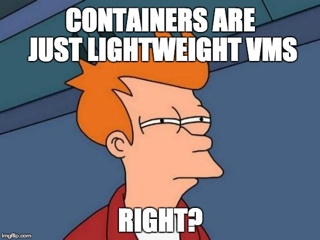
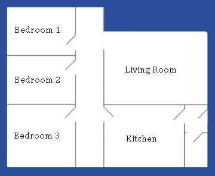

# Docker For WordPress Developers


---

# How many of you have heard of Docker?

--- 

# How many of you use Docker with WordPress?

---

# What | Why | How | When

---

# Peter Fisher
- Freelance Full Stack Web Developer
- Host of the How To Code Well
  - Podcast howtocodewell.fm
  - YouTube channel youtube.com/howtocodewell
  - Twitch live coders team twitch.tv/howtocodewell
  - Discord server howtocodewell.net/discord
  - Tutorials and courses howtocodewell.net


---
# What is Docker?

---


---
# Docker is a containerization technology

---
- A system is split into multiple containers
- Each container has a single responsibility
- Each container can be duplicated
---

# What does this mean for WordPress?

---

### The components of WordPress can be split into multiple containers

---

- Database
- Webserver
- PHP
- Logging
- Cron jobs
- Misc

---
# Each component can be
- Scaled
- Replicated
- Duplicated
- Monitored

---

# Docker has 3 parts

1) The client
2) The API
3) The Engine

---
# Docker Client

- Command line
- Desktop GUI
- Web based / other
---
# Docker API

Communication layer

---
# Docker Engine

The backend of Docker which handles all the Docker objects (networks/containers/images/volumes/etc)

---
# How is a container born


---

### A Docker container is built from a Docker image

---

### A Docker image is made from many cached intermediate images


---
### A Dockerfile is a set of build instructions


---
## Baking Docker containers is like baking cookies

---

### A Dockerfile is the recipe


---
### Building a Docker Image is like putting the cookies in the oven


---

### Docker Containers are the chewy chocolatey goodness


---

# What is the difference between VM's and Containers?

---


---
# Containerization != Virtualization

---
## Virtualization is like a house


---
## Containerization is like a room


---
# Different levels of abstraction

---
# Virtualization
- Custom Environment
- Allocated Resources
- Ecosystem

---
# Containerization
- Single process
- Single responsibilty
- Single purpose

---
# Docker can be used continuous integration / delivery

---

## Docker Images can be tagged to match your deployment workflow
```bash
$ docker build -t company/project:latest -t company/project:1.2.3 .
$ docker pull company/project:latest
$ docker run company/project:1.2.3
```
---
# How to use Docker with WordPress

---
### https://github.com/pfwd/wordpress-install

---
# We will need
- Docker
- Docker compose
- Docker machine (optional)

---
## Docker Machine (Optional)
```bash
$ docker-machine create wordpress-install
$ docker-machine env wordpress-install
$ eval $(docker-machine env wordpress-install)
```
---
## Dockerfile
```dockerfile
FROM php:7.2.18-apache as builder-base
RUN apt-get update                                      && \
    apt-get install -y git zip mysql-client             && \
    docker-php-ext-install mysqli                       && \
    a2enmod rewrite                                     && \
    rm -rf /var/lib/apt/lists/*
ENV APACHE_DOCUMENT_ROOT /var/www/html/
ADD vhost.conf /etc/apache2/sites-available/000-default.conf

RUN curl -s https://getcomposer.org/installer \
    | php -- --install-dir=/usr/local/bin --filename=composer

COPY . /var/www/html/
```

---
## Docker compose - Structure
```yaml
version:

networks:

volumes:

services:

```

---
## Docker compose - Version
```yaml
version: '3.7'
```
---
## Docker compose - Network
```yaml
networks: 
    wordpress:
```
---
## Docker compose - Volumes
```yaml
volumes: 
    db-data:
```

---
## Docker compose - Services
```yaml
services: 

    apache2:
    
    mysql:
```

---
## Docker compose - PHP Apache
```yaml
  apache2:
    build:
      context: .
    env_file:
      - .env
    restart: always
    ports:
      - "80:80"
    volumes:
      - ./:/var/www/html
    networks:
      - wordpress
```

---
## Docker compose - MySQL
```yaml
  mysql:
    image: mysql:5.7
    env_file:
      - .env
    restart: always
    networks:
      - wordpress
    volumes:
      - db-data:/var/lib/mysql
```

---
## Build the Docker images and containers

```bash
$ docker-compose up -d --build
```
---
## Install WordPress
```bash
$ docker-compose exec apache2 composer install
```
---
## Composer
```bash]
  "require":{
    "php": "<=7.3",
    "wordpress": "5.2.4",
    "fancyguy/webroot-installer": "1.1.0",
    "wpackagist-plugin/akismet": "4.0",
    "wp-cli/wp-cli-bundle": "*",
    "wpackagist-theme/twentynineteen": "^1.4"
  },
  "extra":{
    "webroot-dir": "wp",
    "webroot-package": "wordpress"
  }
```
---
## Create the wp-config file

```bash
$ docker-compose exec apache2 bash
$ ./vendor/bin/wp config create                     \
    --allow-root --dbname=${MYSQL_DATABASE}         \
    --dbuser=root --dbpass=${MYSQL_ROOT_PASSWORD}   \
    --dbhost=mysql
$ exit
```

---
# Recap time
---
# MySQL is in a container

---
# PHP / Apache is in a container

---
# Docker compose was used to inject configuration into the containers

---
# MySQL and Apache/PHP are networked together

---
# A Docker volume was created for persistent storage

---
# When should you use Docker?

---
# Just because you can do a thing, doesn't mean you should/need to do a thing

---
# I Dockerize most of my projects even if Docker isn't used in production

---
# But Docker is
- Complicated
- A steep learning curve
- Fragile

---
## Thank you!
Any questions?