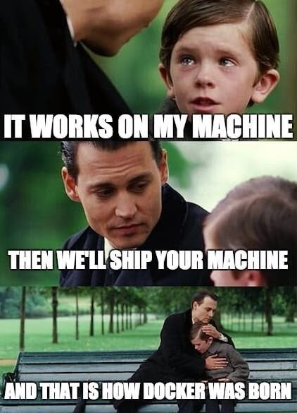
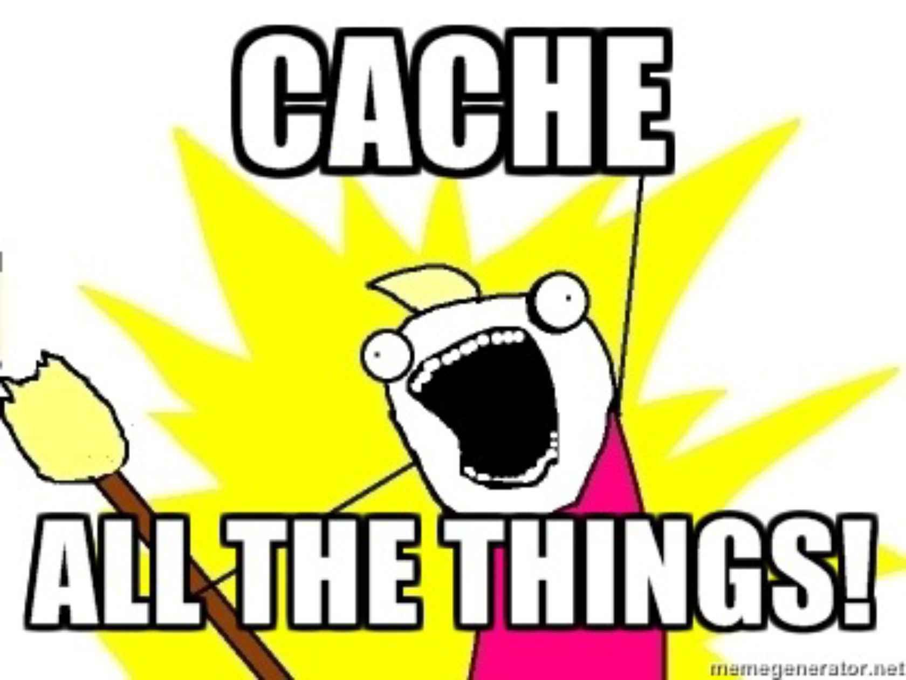

# Docker For WordPress Sites

---

# How many of you have heard of Docker?

--- 

# How many of you use Docker with WordPress?

---

# What | Why/When | How

---
# What is Docker?

---

---
# Docker is a containerization technology

---
- A system is split into multiple containers
- Each container has a single responsibility
- Each container can be duplicated
---
# Docker has 3 parts

1) The client
2) The API
3) The Engine

---
# Docker Client

- Command line
- Desktop GUI
- Web based / other
---
# Docker API

Communication layer

---
# Docker Engine

The backend of Docker which handles all the Docker objects (Networks/containers/Images/Volumes/etc)

---
### A Docker container is built from a Docker image

---
### A Docker image is made from many cached intermediate images

---
### A Dockerfile is a set of build instructions

---
## Baking Docker containers is like baking cookies

---
# A Docker Image is the baked ingredients

---
# A Dockerfile is the recipe

---

# What is the difference between VM's and Containers

---

---
# Containerization != Virtualization

---
## Virtualization is like a house

---
## Containerization is like a room

---
# Different levels of abstraction

---
# Virtualization
- Custom Environment
- Allocated Resources
- Ecosystem

---
# Containerization
- Single process
- Single responsibilty
- Single purpose

---
# Docker can be used continuous integration